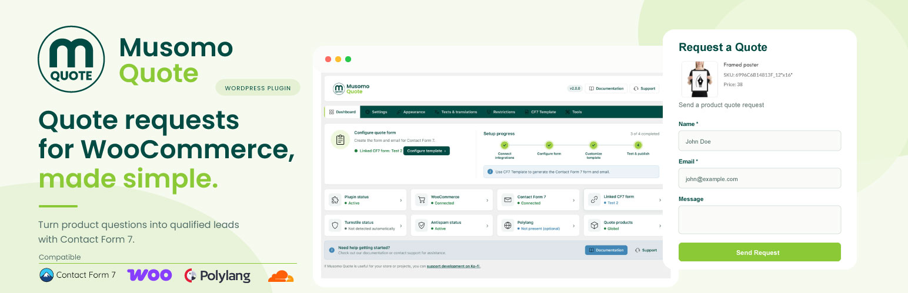

# Musomo Quote

A lightweight quote request plugin for WooCommerce.

**Version:** 2.0.0  
**WordPress:** 6.0+  
**PHP:** 7.4+  
**WooCommerce:** 7.0+

## Download

**[Download Musomo Quote 2.0.0](https://github.com/musomo-design/musomo-quote/releases/download/v2.0.0/musomo-quote-2.0.0.zip)**

Ready-to-install WordPress plugin ZIP.

[View all releases](https://github.com/musomo-design/musomo-quote/releases)

## Introduction
Musomo Quote adds a customizable quote request workflow to WooCommerce products using Contact Form 7. It lets you show a quote button on eligible products, open a product-aware modal, and pass product details into a Contact Form 7 form without replacing Contact Form 7 as the submission engine.

The plugin is designed for WooCommerce site owners, freelancers, agencies, and small businesses that want a lightweight quote workflow without adding a custom customer submissions database.

## Key Features
- `ADD`, `REPLACE`, and `SELECTED` quote modes
- Per-product Musomo Quote toggle for selected products
- Support for simple and variable products
- Product data automatically passed to Contact Form 7
- Quantity and selected variation support
- Customizable quote modal
- Appearance controls for button and modal styling
- Editable frontend texts
- Product restrictions based on categories, stock status, price presence, product type, and logged-in/logged-out users
- Optional anti-spam protections: honeypot, time trap, content filter, and rate protection
- Contact Form 7 template builder
- HTML email template builder
- Product image support in quote emails
- Multilingual overrides when Polylang is available
- Diagnostics tools
- Settings export and import
- Safe reset tools for plugin settings
- No custom customer submission database
- No proprietary AJAX submission endpoint for quote form sending

## Requirements
- WordPress 6.4+
- PHP 8.0+
- WooCommerce 7.0+
- Contact Form 7 for quote form submissions
- Polylang is optional

## Installation
Install Musomo Quote like a standard WordPress plugin:

1. In WordPress admin, go to `Plugins -> Add New -> Upload Plugin`.
2. Upload the plugin ZIP package.
3. Activate the plugin.
4. Open the Musomo Quote admin pages and configure the plugin for your store.

After activation, you can choose a Contact Form 7 form, select the quote mode, and customize the appearance and texts from the WordPress admin area.

## Quick Start
For a simple setup:

1. Activate Musomo Quote.
2. Create or choose a Contact Form 7 form.
3. Select that form in Musomo Quote settings.
4. Choose your quote mode: `ADD`, `REPLACE`, or `SELECTED`.
5. Configure the quote button, modal, and texts.
6. Optionally use the CF7 Template Builder to generate form and email templates.
7. Test the quote flow on a WooCommerce product page.

## Quote Modes
Musomo Quote supports three quote display modes:

### `ADD`
Shows the quote button alongside the normal add to cart flow.

### `REPLACE`
Replaces the add to cart action with the quote workflow when the product is eligible for quotes.

### `SELECTED`
Shows the quote workflow only on products where the Musomo Quote product setting is enabled.

## CF7 Template Builder
Musomo Quote includes a builder that generates Contact Form 7 form code and HTML email templates for your quote workflow.

Important: Musomo Quote does **not** automatically overwrite your Contact Form 7 forms. You copy the generated templates and paste them into Contact Form 7 yourself.

Depending on your configuration, the generated form and email templates can include product-related fields such as:
- product name
- SKU
- price
- quantity
- product URL
- product image
- product type
- product ID

This helps you build quote emails that contain relevant product context while still using Contact Form 7 as the submission and email engine.

## Security & Privacy
Musomo Quote includes optional anti-spam protections for quote forms:
- honeypot
- time trap
- content filter
- rate protection

These protections apply only to Contact Form 7 forms that are linked to Musomo Quote.

For privacy and data minimization:
- Musomo Quote does not keep a permanent raw IP log
- temporary rate limiting uses a hashed IP transient
- quote submissions are handled by Contact Form 7
- Musomo Quote does not maintain its own customer submission database

Turnstile is not implemented directly by Musomo Quote. If needed, you can use external or Contact Form 7 compatible integrations separately.

## Multilingual
Musomo Quote can work with Polylang when Polylang is available.

You can keep global default texts and, when needed, define per-language overrides for supported plugin texts and linked Contact Form 7 forms. If no language-specific override is configured, Musomo Quote falls back to the global value.

Musomo Quote does not provide automatic translation.

## Tools
Musomo Quote includes a small set of maintenance tools:

- **Diagnostics** for checking plugin and integration status
- **Export / Import** for moving plugin settings between sites
- **Reset** tools for restoring specific Musomo Quote settings safely

## Support
- Bug reports and issues: [GitHub Issues](https://github.com/musomo-design/musomo-quote/issues)
- Musomo Design website: [https://musomo.net](https://musomo.net)

## Support the development
If Musomo Quote is useful for your business or projects, you can support continued development here:

[Support the development on Ko-fi](https://ko-fi.com/musomo)

## Roadmap
- Compatibility maintenance
- Accessibility improvements
- Documentation improvements

## License

Musomo Quote is licensed under the GNU General Public License v2.0 or later (GPL-2.0-or-later).

---

Musomo Quote — developed by Musomo Design.
